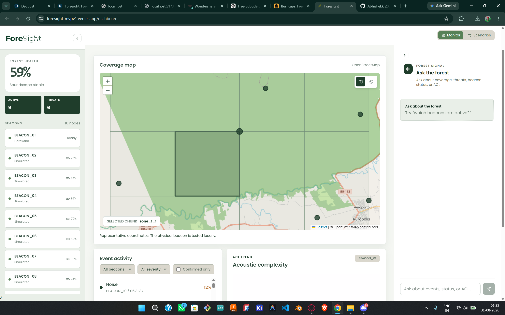
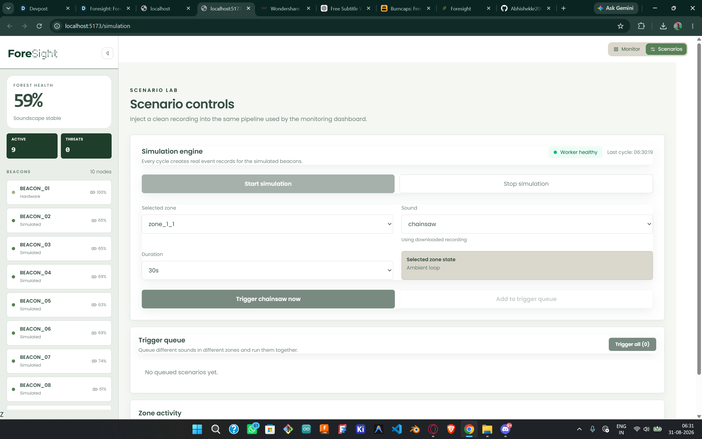
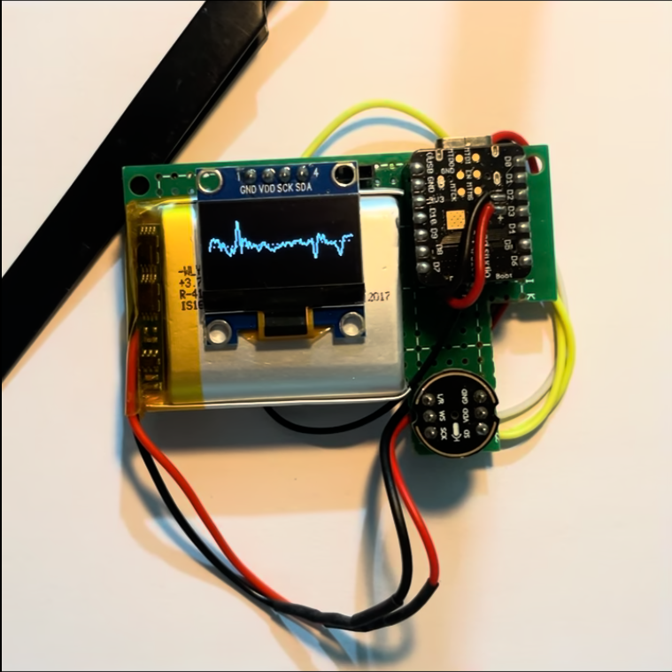
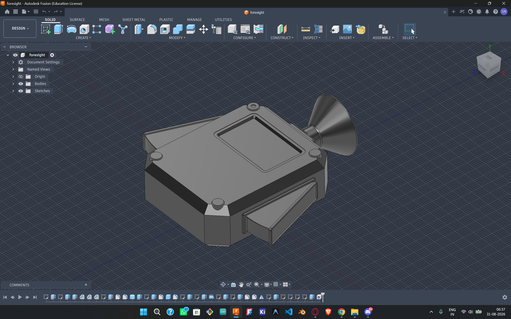

# Foresight

Foresight is a forest acoustic surveillance demonstrator that turns remote audio signals into a live operational picture. It combines simulated or physical beacon data, machine-learning classification, acoustic scoring, event correlation, and an interactive React dashboard.

> This is a prototype and demonstration system. The map coordinates represent the Tapajós National Forest area; they do not represent a live production deployment.

## Product preview

### Monitoring dashboard

### Scenario laboratory

### Hardware integration

### 3D experience

## What it does

- Receives audio and heartbeat data from ESP32 beacons or the built-in simulator.
- Classifies environmental and threat sounds with YAMNet.
- Calculates an Acoustic Complexity Index (ACI) for forest soundscape health.
- Combines classifier confidence and acoustic complexity into threat scores.
- Correlates events from nearby beacons to identify confirmed incidents.
- Streams live event, status, and simulation updates to the dashboard over WebSockets.
- Stores high-scoring recordings for later replay when Supabase Storage is configured.
- Provides a scenario lab for testing chainsaw, gunshot, rain, birds, wind, and other sounds.

## Architecture

    ESP32 beacon or simulator
              │ audio + heartbeat
              ▼
          FastAPI backend
              │
              ├── YAMNet / LiteRT classification
              ├── ACI and threat scoring
              ├── event correlation
              ├── PostgreSQL or SQLite persistence
              └── Supabase audio storage (optional)
              │ REST + WebSocket
              ▼
          React dashboard

The backend lives in backend/ and the Vite React frontend lives in frontend/. The root Dockerfile is configured for the lightweight LiteRT classifier used by Render deployments.

## Tech stack

- Frontend: React, Vite, React Leaflet, Tailwind CSS, Phosphor Icons
- Backend: FastAPI, SQLAlchemy, Pydantic Settings, Uvicorn
- Audio: SoundFile, NumPy, YAMNet, TensorFlow Hub, LiteRT
- Data and storage: SQLite locally, PostgreSQL/Supabase for hosted use
- Deployment: Vercel for the frontend and Render/Docker for the backend

## Local development

### Prerequisites

- Python 3.11 for the full TensorFlow/YAMNet setup
- Node.js 22.x and npm
- PostgreSQL/Supabase only if you do not want to use local SQLite

### Configure the backend

From the repository root:

    Copy-Item backend\.env.example backend\.env

The default local configuration uses SQLite and enables simulation. Edit backend/.env only when you need PostgreSQL, Supabase Storage, Gemini, or different simulation settings.

### Install the full local audio stack

    py -3.11 -m venv backend\.venv-yamnet
    backend\.venv-yamnet\Scripts\python.exe -m pip install -r backend\requirements.txt

Download and cache YAMNet once:

    cd backend
    .\.venv-yamnet\Scripts\Activate.ps1
    python -c "import tensorflow_hub as hub; hub.load('https://tfhub.dev/google/yamnet/1'); print('YAMNET_READY')"
    cd ..

Local development uses CLASSIFIER_BACKEND=full. Render uses the smaller LiteRT backend through the root Dockerfile.

### Start the backend

    cd backend
    .\.venv-yamnet\Scripts\Activate.ps1
    python -m uvicorn app.main:app --host 0.0.0.0 --port 8000

Useful endpoints:

- API: http://localhost:8000
- Swagger docs: http://localhost:8000/docs
- Health check: http://localhost:8000/health
- Classifier status: http://localhost:8000/api/debug/classifier

### Start the frontend

In a second terminal:

    cd frontend
    Copy-Item .env.example .env
    npm install
    npm run dev

Open http://localhost:5173. The frontend reads the backend URL from VITE_API_URL and defaults to http://localhost:8000.

## Configuration

Backend variables are documented in [backend/.env.example](backend/.env.example). Frontend variables are documented in [frontend/.env.example](frontend/.env.example).

| Variable | Purpose |
| --- | --- |
| DATABASE_URL | SQLite or PostgreSQL connection string |
| ENABLE_SIMULATION | Enables the simulated beacon worker |
| BEACON_CONFIG_PATH | Path to beacons_config.json |
| CORS_ORIGINS | Comma-separated frontend origins allowed by the API |
| CLASSIFIER_BACKEND | full for local TensorFlow/YAMNet or lite for LiteRT |
| SUPABASE_URL / SUPABASE_SERVICE_ROLE_KEY | Optional hosted audio storage |
| GEMINI_API_KEY | Optional Forest Insight assistant integration |
| VITE_API_URL | Public backend URL used by the frontend |

Never commit real API keys, database passwords, or Supabase service-role keys.

## Simulation lab

The simulator continuously processes ambient audio for configured simulated beacons. The Scenario Lab can trigger a sound in a selected map zone and reports the beacon IDs assigned to that zone.

Example trigger:

    $body = '{"zone":"zone_0_0","sound":"chainsaw","duration_seconds":60}'
    Invoke-RestMethod -Uri 'http://localhost:8000/api/simulation/trigger' -Method Post -ContentType 'application/json' -Body $body

Available threat sounds are chainsaw, gunshot, vehicle, engine, and chopping. Test sounds include birds, frogs, insects, rain, wind, and monkey.

Use GET /api/simulation/status to inspect worker health, active zone scenarios, and beacon assignments. A healthy classifier should report 521 YAMNet labels.

## Hardware integration

The ESP32 integration is represented by backend ingestion endpoints and is intended for local-network testing. The physical beacon is not required to run the dashboard.

    POST /api/ingest/audio
    POST /api/ingest/heartbeat

Beacon locations are configured in [beacons_config.json](beacons_config.json). The included coordinates are representative demonstration coordinates.

## API highlights

- POST /api/ingest/audio — upload beacon audio for classification
- POST /api/ingest/heartbeat — update beacon health and battery state
- GET /api/beacons — list configured beacons
- GET /api/events — list processed events
- GET /api/status — current dashboard status
- GET /api/summary — dashboard summary metrics
- GET /api/aci — acoustic complexity history
- POST /api/simulation/start — start the simulation worker
- POST /api/simulation/stop — stop the simulation worker
- POST /api/simulation/trigger — trigger a sound in a zone
- WS /ws — receive live event and status updates

## Testing and production build

Run backend tests from the backend directory:

    cd backend
    $env:PYTHONPATH = '.'
    pytest -q tests

Build the frontend:

    cd frontend
    npm run build

## Deployment

### Backend on Render

Create a Render Web Service using the repository root as the Docker build context. The repository already includes Dockerfile and render.yaml. Configure backend secrets in Render Environment Variables, especially:

- DATABASE_URL
- CORS_ORIGINS with the deployed Vercel URL
- Supabase variables if hosted audio storage is required
- ENABLE_SIMULATION according to whether the demo worker should run

The Docker image copies beacons_config.json, audio assets, and LiteRT model files into the container. Render should expose the service on its supplied PORT and use /health as the health-check path.

### Frontend on Vercel

Create a Vercel project from the same repository with:

- Root Directory: frontend
- Framework preset: Vite
- Build command: npm run build
- Output directory: dist
- Environment variable: VITE_API_URL=https://your-render-service.onrender.com

After deployment, add the Vercel origin to the backend CORS_ORIGINS value and redeploy the backend if necessary.

## Troubleshooting

- FileNotFoundError for beacons_config.json: check BEACON_CONFIG_PATH and ensure Render uses the repository-root Dockerfile.
- Frontend CORS errors: set CORS_ORIGINS to the exact Vercel origin, without a trailing path.
- yamnet_loaded is false: verify the local full YAMNet cache or the Render LiteRT model and labels.
- Render memory exhaustion: use the LiteRT Docker deployment rather than full TensorFlow on the 512 MB plan.
- Supabase EMAXCONNSESSION: reduce connection pressure, avoid duplicate backend workers, and use an appropriate pooled database connection string.

## Project status

Foresight is a working prototype for demonstrating acoustic monitoring workflows, not a finished field-deployed conservation system. Hardware transport, model tuning, production authentication, observability, and long-term data retention remain areas for future development.
